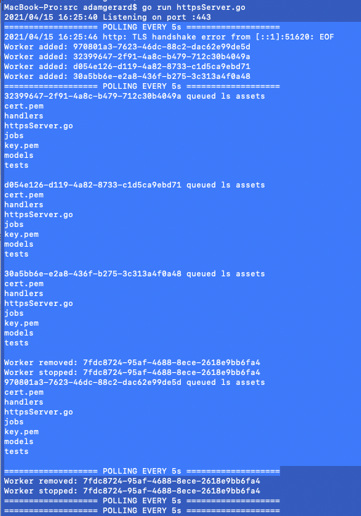
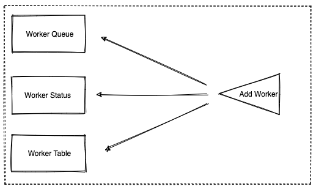
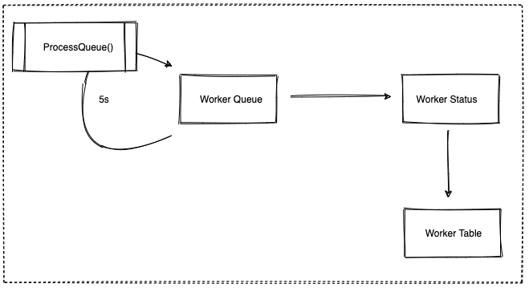
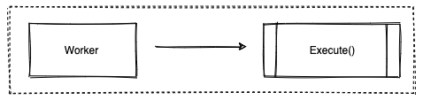
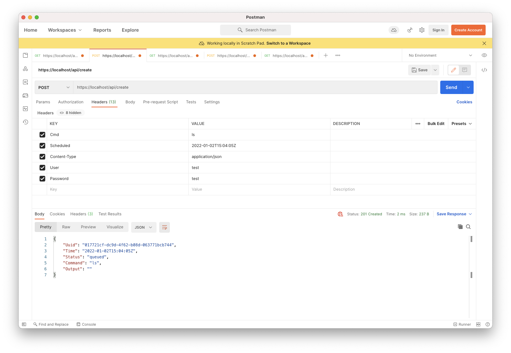
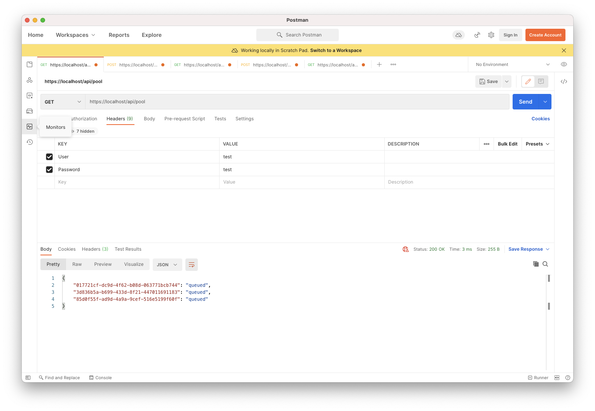
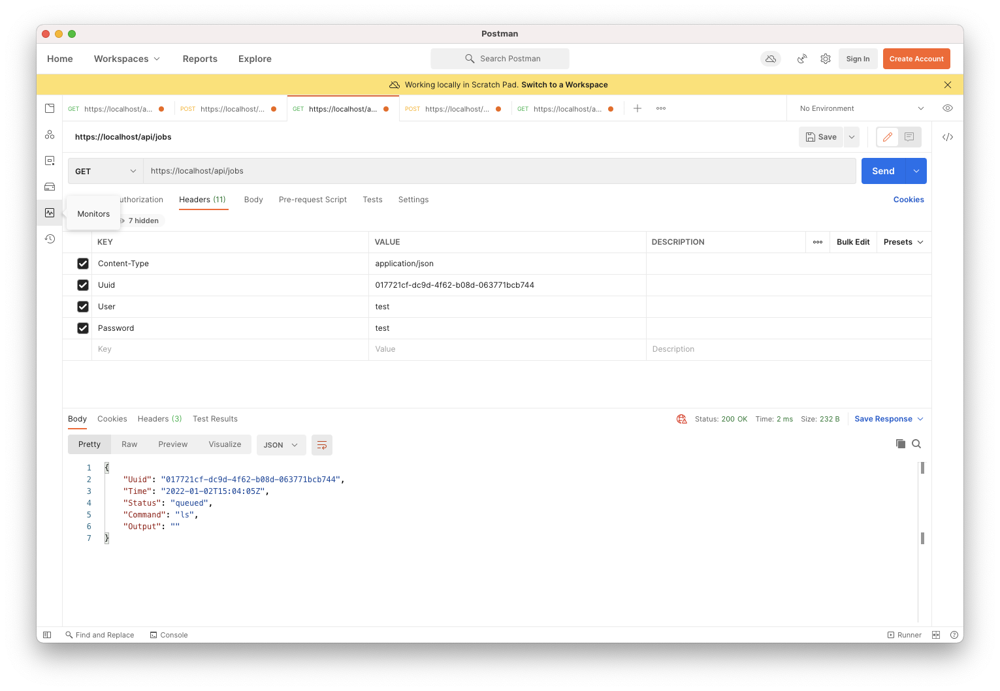
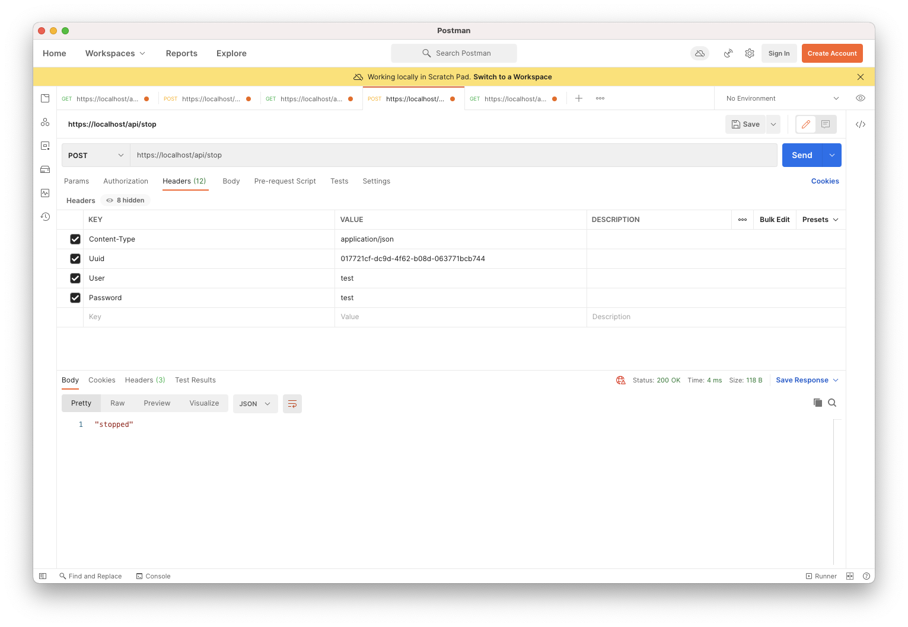

# Design Document

[](https://golang.org/pkg/)

This document summarizes my approach to the Teleport Level One Backend Engineer challenge (per [requirements](https://github.com/gravitational/careers/blob/main/challenges/systems/worker.pdf)).

----

## Worker Library



In order to avoid concurrency concerns (concurrent iteration, reading, and writing), I've divided my "Worker Queue" into three parts. Each part is implemented as a **Map**:

1. [Worker Queue](src/models/WorkerQueue.go) - table used to process **Worker** objects based on scheduled time implemented as a `map[string]time.Time` (`uuid` -> `scheduled time`).

   

1. [Worker Table](src/models/WorkerTable.go) - lookup table for actual **Worker** objects implemented as a `map[string]WorkerModel` (`uuid` -> `worker object`).
1. [Status Table](src/models/StatusTable.go) - lookup table for the status of any previous or extant **Worker**  implemented as a `map[string]string` (`uuid` -> `worker status`).

The **Worker Queue** object is processed via the [Job Loop](src/jobs/JobLoop.go) which polls the **Worker Queue** every 5 seconds in [ProcessQueue()](src/jobs/Run.go).



A simple **Time** comparison is performed to verify whether a task should be executed or not.



### Advantages of this approach

1. The "Worker Queue" need not be a **Stack**, **Linked List**, **Dequeue**, or actual **Queue** since the order of arrival doesn't matter. (This is why I put "Worker Queue" in quotes.)
1. I can define a unique **Mutex** by dividing the Worker Queue into several individual, singleton, units. If these were combined into a single object (say one with three **Maps**) that shared a single **Mutex**, concurrency issues would likely arise.
1. Each part is a singleton - a source of truth throughout the app and service. It guarantees that when an object is read, it's accurate.
1. Each part will be backed by CRUD operations (Java Spring Boot repository-style design pattern) that act as getters and setters. This simplifies management and allows **Mutexes** to be locked and unlocked so that concurrent operations on the same object don't lead to issues.
1. By dividing the "Worker Queue" into multiple parts, I can reduce I/O and reads on the same objects. For many operations I only need to see a **Worker's** status. For others, I only need to see the **Worker's** schedule time.
1. Read, delete, update, and insert operations are performed in approximately O(1) time.

### Disadvantages of this approach

1. May not be the best way to represent, or most efficiently hold and process **Workers**.
1. Tables can grow to enormous sizes over time. No hard limit is currently implemented. 
1. No worker retries.
1. No support for complex task operations - no IPC equivalent (inter-process communication). Jobs cannot be executed depending on the success or failure of other jobs.
1. Timestamp localization has not been implemented. On the one hand, the API is not envisioned as a global, public-facing, API. On the other hand, the possibility of submitting jobs across multiple timezones still exists as a live-possibility for any likely real-world scenario.
1. Hard-coded bash commands and no cmd-injection or safe-string protection implemented. This would likely be at least partly handled by explicitly specifying user inputs as an **Enum** to prevent unintended commands from being run on the server.
1. No dead queue.
1. No queue topics.
1. Not a publish-subscribe implementation (follow-up query required).

### Comparison with other approaches

1. I don't use buffered channels here since jobs need to be persisted (in memory) and scheduled to be run in the future.
1. There isn't a need to use buffered channels here except when the **Worker** task is actually executed.

### Worker

1. A [worker](src/models/WorkerModel.go) is defined as an uuid, scheduled time, bash command to be executed at that time, status, and an output capturing the result of an executed task.
1. I've hardcoded this to always be `ls` since the requirement doc doesn't specify that commands must be unique. In a real-world scenario, a list of commands would likely be specified as an **Enum** with some underlying Bash commands executed within a select, case, or switch statement. To mimic lengthier processes, a timeout of 3 seconds is enforced within each task.
1. **Worker** are saved into the [Worker Table](src/models/WorkerTable.go) map in-memory. They're removed following a `failed`, `completed`, or `stopped` status update.
1. The status workflow goes as follows: 
   1. [`queued`] -> [`executing`] -> [`failed`, `completed`]
   1. [`queued`] ->[`stopped`]
1. When a **Worker** is executed, the bash command is executed within a go routine. Its output is passed to a buffered channel specific to that worker. This is done to allow the contents of a command operation to be loggable and queryable.

[Worker](src/models/WorkerModel.go) receiver functions provide execute task support. 

Adding and stopping operations involve modifying several tables and have been abstracted to job-specific [helpers](src/jobs/Job.go).

----

## TLS REST API

The API uses the most basic authentication and supplies endpoints to query the **Worker Status** table, **Workers**, stop **Workers**, and submit **Workers** to the **Worker Queue**.

> The default authentication settings are: `User`: `test` and `Password`: `test`.

> API HTTP headers are case-insensitive.

> The API uses a self-signed TLS certificate generated through OpenSSL.

> Successful POST requests will return status code `201` and successful GET requests will return status code `200`.

### Endpoints

1. GET - https://localhost/public/

   Brings up a simple HTML client.

   

1. POST - https://localhost/api/create

   With headers:

    1. `Cmd` - `string` - bash command - this will be converted to `ls` so anything you pass in here is fine to send.
    1. `Scheduled` - `string` - valid go `time.RFC3339` [parsable string](https://golang.org/pkg/time/#example_Parse): `"2006-01-02T15:04:05Z"`
    1. `Content-Type` - `application/json`
    1. `User` - `string`
    1. `Password` - `string`

    

1. GET - https://localhost/api/pool

   With headers:

    1. `Content-Type` - `application/json`
    1. `User` - `string`
    1. `Password` - `string`

   Response:
    ```
    {
        "10a8952b-d730-447c-b1d8-b15614944246": "queued",
        "15fa758d-9c8e-4eef-877a-e332675e55fe": "completed",
        "2866b264-513f-4a68-88d2-d8ee4f294f7f": "completed",
        "4e7b801c-4fd6-4b4d-87dc-c1ce1481d4af": "completed",
        "59c904ca-bbbc-4d1b-8831-ce86725d440e": "completed",
        "86480c6d-2134-4aca-82e4-7854e3041ab1": "completed",
        "b3e8cc19-4a3c-4c83-8b11-26698d1db2a8": "executing",
        "cbaf1e15-ec3a-4182-b122-b7e235b103c0": "completed",
        "dff12a72-932b-44eb-80d3-acf4c29b2aeb": "completed"
    }
    ```

    

1. GET - https://localhost/api/jobs

   With headers:

    1. `Content-Type` - `application/json`
    1. `Uuid` - `string` - uuid of **Worker**
    1. `User` - `string`
    1. `Password` - `string`

   Response:
    ```
    {
        "Uuid": "2f99ae7c-992c-42bd-9df3-293101086d08",
        "Time": "2021-01-02T15:04:05Z",
        "Status": "queued",
        "Command": "ls",
        "Output": ""
    }
    ```

    

1. POST - https://localhost/api/stop

   With headers:

    1. `Content-Type` - `application/json`
    1. `Uuid` - `string` - uuid of **Worker**
    1. `User` - `string`
    1. `Password` - `string`

   Response:
   
    ```
    "stopped"
    ```

   This API will return `completed`, `failed`, or `stopped`.

   

1. GET - https://localhost/api/status

   With headers:

   1. `Content-Type` - `application/json`
   1. `uuid` - `string` - uuid of Worker
   1. `user` - `string`
   1. `password` - `string`

   Response:

    ```
    "stopped"
    ```

   This API will return `completed`, `failed`, or `stopped`.

### Limitations

1. No rate limiting.
1. Only the very-most basic authentication.
1. No timeout logic for stale connections.
1. Only self-signed TLS encryption - no additional encryption of plaintext passwords.
1. No batching.
1. No pagination.
1. No client-side or server-side verification of user-submitted bash. (This is hard-coded to `ls` so no malicious attacks could be here. See comments above.)

----

## Client

Two ways of interacting with the API are provided:

1. Via HTML and XHR - https://localhost/public/
1. Via Postman

### Advantages

1. Postman allows caching.
1. UI/UX interface.
1. Static pages - very lightweight interface.

### Limitations

1. No token caching - not JWT.
1. No client-side form-validation.
1. No websocket, SSE, or other streaming connections.
1. Self-signed certificate may not be compatible with any browser except for Safari.
1. HTML client is not a SPA.